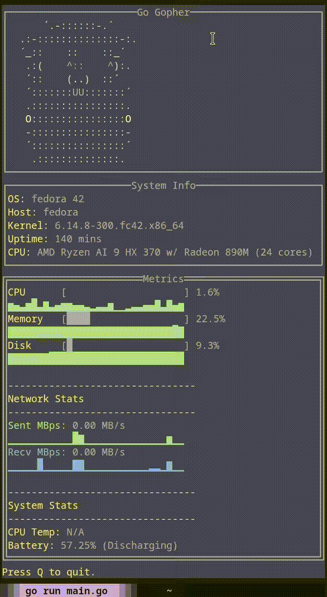

# 📈 GO Resource Monitor

    [](https://go.dev/)

A lightweight resource monitor dashboard written in Go using TUI.

## Features:
- 🐹 Animated ASCII Gopher mascot
- 📊 Real-time CPU, Memory, Disk usage with sparklines
- 🌡️ CPU & multi-GPU temperature and utilization monitoring
- 💾 Disk I/O monitoring with sparklines
- 🌐 Network throughput stats
- 🔋 Battery status
- 🖥️ Two-column responsive layout
- 🎨 Clean, colorful TUI

## Looks


## Usage:
1. Install package globally
```
go install github.com/krisfur/go-resource-monitor@v0.1.3
```
2. Run it
```
go-resource-monitor
```
3. Press Q to quit.


If you need to add go modules to path do:
```bash
export PATH="$HOME/go/bin:$PATH"
```

## Dependencies:
- tview (https://github.com/rivo/tview)
- tcell (https://github.com/gdamore/tcell)
- gopsutil (https://github.com/shirou/gopsutil)
- distatus/battery (https://github.com/distatus/battery) for battery info


Dependencies are managed via Go modules.

## License:
MIT
